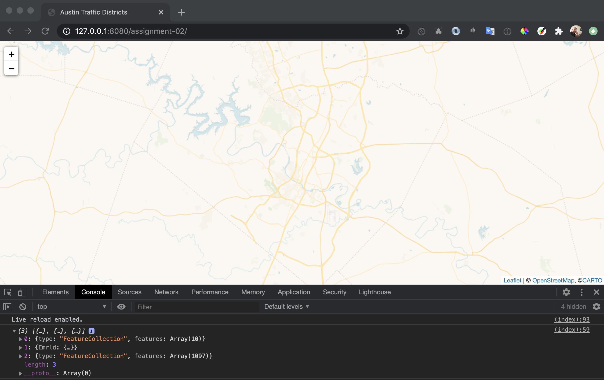
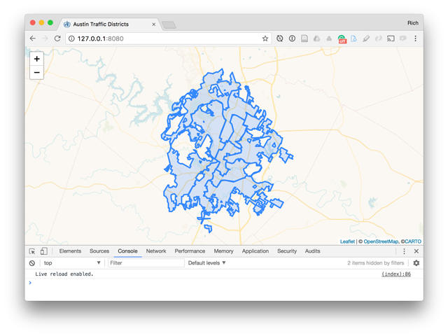
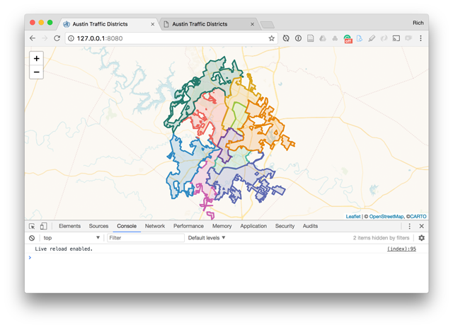
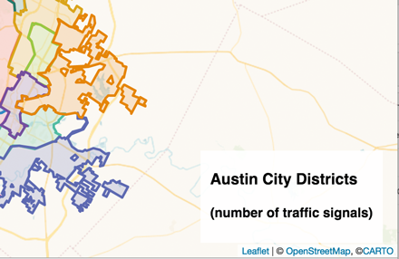
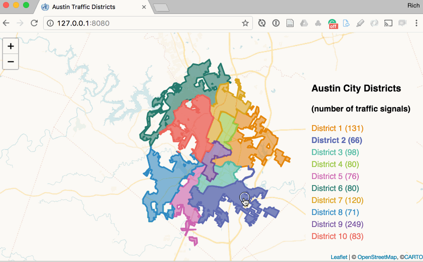
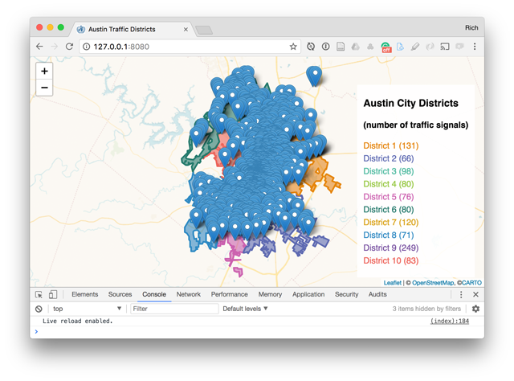
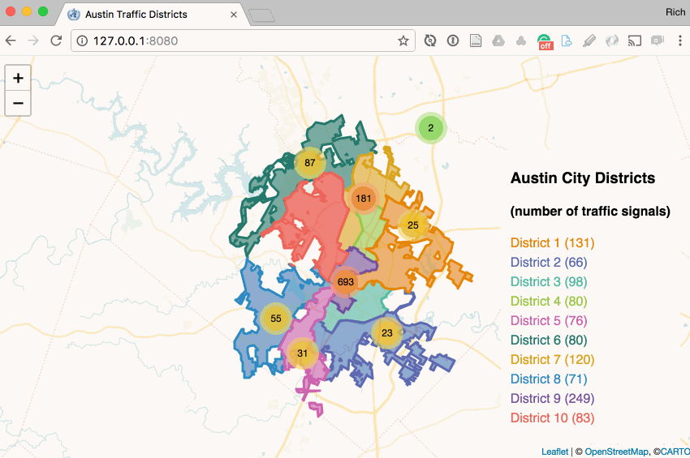

# Assignment 02: Mapping with Node <!-- omit in toc -->

Your assignment consists of two parts. The first continues the process to integrate the data files we worked within the lesson within a web map demonstrated some very basic coordinated visualization. The second part will ask you to find, explore, and process a new data set and make a similar map to the one created below in part 01.

## TOC <!-- omit in toc -->

- [Part 01: Make a map! (4 Points)](#part-01-make-a-map-4-points)
  - [Drawing and styling the districts using a color scheme](#drawing-and-styling-the-districts-using-a-color-scheme)
  - [Creating a coordinated viz legend](#creating-a-coordinated-viz-legend)
  - [Using the Leaflet.markercluster plugin to deal with too many markers](#using-the-leafletmarkercluster-plugin-to-deal-with-too-many-markers)
- [Part 02: Make another map! (6 points)](#part-02-make-another-map-6-points)
  - [Requirements](#requirements)

## Part 01: Make a map! (4 Points)

Begin with your basic web map created in Lesson 02, _map675-module-02-username/index.html_. Open the file in a text editor and run with a localhsot server in the browser.

In Lesson 02 we used the D3-fetch module to request the US counties GeoJSON and Leaflet to draw that data to the map, like this:

```javascript
  d3.json('data/us-counties.json').then((data) => {
      L.geoJson(data).addTo(map)
  });
``` 

We'll now modify the code to 1.) recenter the map on Austin, TX and 2.) load three datasets into our application, rather than just the one us counties file.

Update the Leaflet map origin:

```js
  center: [30.30927, -97.74211],
  zoom: 10
```

Remove the request for the _us-counties.json_ file and instead reqeust three of the JSON-based files created within Lesson 02:

* The GeoJSON polygons of Austin's districts containing the total count of traffic lights within teach (_austin-districts-counts.json_)
* The Vivid color scheme we extracted using the _fs-asynic.js_ script (_vividcolors.json_)
* The Austin traffic signals we convereted from CSV to GeoJSON (_austin-traffic-signals.json_)


We'll load all three of these files asynchronously using D3-fetch and the native [Promise.all() method](https://developer.mozilla.org/en-US/docs/Web/JavaScript/Reference/Global_Objects/Promise/all) to ensure they've loaded before sending the data into another function we'll name drawMap.


```js
// use D3 fetch to request data with async requests
const districtsData = d3.json('data/austin-districts-counts.json');
const colorsData = d3.json('data/vividcolors.json');
const trafficData = d3.json('data/austin-traffic-signals.json');

// use Promise to wait until data is all loaded
Promise.all([districtsData, colorsData, trafficData]).then(drawMap);


function drawMap(data) {
  // function is called when Promise is fulfilled and data is ready

  // inspect array of data
  console.log(data);

  // pull out separate data arrays and assign to variables
  const districts = data[0];
  const colors = data[1];
  const signals = data[2];
}
```

Once the function drawMap is called, all of the datasets are serialized within an array and refered by the parameter `data` within the function. They are ordered in the order they are listed within the `.all([])` call. 

Note that you can also modify the Promise to catch errors as well: https://developer.mozilla.org/en-US/docs/Web/JavaScript/Reference/Global_Objects/Promise/catch

If you load this file using live-server (or another local server) in your browser, you'll note that it's simply loading Leaflet map with the CARTO Voyager basemap. With your web developer tools open to Console, you can see our logged output: the two FeatureCollection GeoJSONs and the single CARTO colors JSON file.

  
**Figure 01.** Blank Leaflet Map with Voyager basemap tiles.

You'll also notice a _libs/Leaflet.markercluster/_ directory containing a Leaflet Plugin used to cluster markers (used later in the end of this assignment).

We're now ready to draw our data to the map, apply some coordinated visualization techniques, and deal with too many markers of those traffic signals using a Leaflet plugin named Leaflet.clusterMarker.

### Drawing and styling the districts using a color scheme

For this map we wish to 

Within the _index.html_ file provided, we again use D3's fetch module to asynchronously request some files from a _data/_ directory. While there are other options for requesting data files in a client script (jQuery, Omnivore, etc.), this is likely the best way to do it (for now).

When the files are loaded and ready, we use the `then()` method of the Promise to send all of them (3 in this case) to a function we've written as `drawMap()` as a single array. We've named this parameter `data`within the `drawMap()` function:

```javascript
  // use Promise to wait until data is all loaded
  Promise.all([districtsData, colorsData, trafficData]).then(drawMap);

  function drawMap(data) {
    // function is called when Promise is fulfilled and data is ready

    // inspect array of data if you wish
    console.log(data);

    // pull out separate data arrays and assign to variables
    const districtsGeojson = data[0];
    const colorsJson = data[1];
    const signalsGeojson = data[2];

    // convert GeoJSON to Leaflet L.geoJson() object and add to the map
    L.geoJson(districts).addTo(map);
  }
  ```

For convenience and clarity, we pull the datasets out of the array and assign them to variables, and we have quickly added the district polygons to the Leaflet map using the default Leaflet styles:
  
**Figure 02.** Leaflet map with council district polygons drawn with default styles.

Next, we want to style each polygon with a unique color. We'll use a qualitative color scheme (rather than a quantitative, sequential color scheme) because we're treating these units as categorically distinct.

Now consider the following changes to the script, using the L.geoJson() `style` option:

```javascript
// create a layerGroup with the geojson data
const districtsLayerGroup = L.geoJson(districts, {
  style: function (feature) {
    // use the colors object to style each polygon a unique color
    return {
      color: colors.Vivid[10][feature.properties.council_di - 1],
      fillOpacity: .6
    }
  }
}).addTo(map);
```

While we could hard-code some color values into a function as we've done in the past, instead we can use the colors object we've loaded into the script from our _vividcolors.json_ file. Each feature of our council districts has a unique id number value (in the properties encoded with the `council_di` property). We can conveniently use this number to access the color values within the `colors` object array containing 10 distinct color values.

You may be thinking about how we've often used JS else/if statements or a switch statement within a new function named `getColor()` or something similar to return a color value and assign it to the style property `color`. This approach illustrates a more eloquent approach using the object literal stored within the color file:

```json
"10":["#E58606","#5D69B1","#52BCA3","#99C945","#CC61B0","#24796C","#DAA51B","#2F8AC4","#764E9F","#ED645A","#A5AA99"]
```

If you're astute, you'll notice that this array actually contains 11 hex color values and not 10. This is because CARTO includes an additional color for an "other" category (`#A5AA99`, which we won't use). It's the last item in the array, which is why we need to begin the zero index of the array.

  
**Figure 03.** Council districts colored with Vivid styles.

 Add and commit your changes up until this point to the project with an appropriate commit message. We have used the Node scripts written in Lesson 02 to help process our data and plotted one of the datasets with a quantitative color scheme. We now have basic (but so far useless) thematic map using a qualitative color scheme. Let's make it more fun and useful.

### Creating a coordinated viz legend

Any good map requires a legend. We're going to build one dynamically using the Vivid color scheme we've created. 

Furthermore, we're going to implement what's known as "coordinated visualization," which refers to linking different data graphics so that interaction with one triggers changes or affordances in another. A textual legend isn't the most robust of infographics, but this basic example will demonstrate the conceptual and technical aspects.

For this example we'll use jQuery, so go ahead and request that within your document (at the bottom, with the other JS scripts):

```html
<script src="https://code.jquery.com/jquery-3.3.1.min.js"></script>
```

We can first create a new DOM element by writing HTML to hold our legend:

```html
<div id="ui">
    <h3>Austin City Districts</h3>
    <h4>(number of traffic signals)</h4>
    <ul id="legend-list"></ul>
</div>
```

Of course, when we create HTML elements we often want some CSS rules to select those elements and apply styles. Note here we'll include some CSS rules for the `<li>` and `<a>` elements that we'll be generating dynamically with the JavaScript, as well as a `.highlight` class which we can apply to elements for interactively-triggered affordances.

```css
#ui {
    position: absolute;
    z-index: 1000; /* place above map */
    bottom: 18px;
    right: 18px;
    padding: 6px 12px;
    background: rgba(256,256,256,.9);
}

#ui ul {
    list-style-type: none;
    padding: 0;
}
#ui li {
    margin-bottom: 6px;
}
#ui a {
    text-decoration: none;
}
#ui a:hover {
    font-weight: bold;
}
.highlight {
    font-weight: bold;
}
```

These additions will produce a static element on the page that will hold our legend.

  
**Figure 04.** Static legend container ready for dynamic elements.

Next, before we create the `districtsLayerGroup` and add it to the map, we can:

1. Select our empty legend list
2. Loop through our districts features
3. For each feature, append a new list item (`<li>`), giving each a common class attribute (`class="legend-item"`) and a unique id attribute using the iterating number that refers to each polygon (`d="district-' + i + '"`). We'll place the text for each within `<a>` tags and style them using the Vivid color scheme in a similar way as we did when coloring the polygons.

```javascript
const districts = districtsData[0];
const colors = colorsData[0];
const signals = signalsData[0];

// store a reference to the HTML list
const legendList = $('#legend-list');

// loop through the features and create a new
// list item for each feature in the legend
for(let i = 1; i <= districts.features.length; i++) {
    legendList.append('<li class="legend-item" id="district-' + i + '"><a style="color:' + colors.Vivid[10][i -1] + '" href="#">District ' + i + ' (<span></span>)</a></li>');
}
```

Adding this JavaScript should produce a legend color-coded to match the polygons. Note that we've included some still empty parentheses enclosing empty span tags.

  
**Figure 05.** Static legend container containing feature names.

Next, we can add an `onEachFeature` option to our L.geoJson() constructor to achieve the following:

1. select each `<span>` tag within our legend to update the total number of counts for each feature
2. apply a `mouseover` and `mouseout` event to each layer to:
    * provide a visual affordance on the map polygon changing the `fillOpacity` style property
    * select the corresponding list item and add/remove the `highlight` class we defined in the CSS

Here I've included the entire structure:

```javascript
// create a layerGroup with the geojson data
const districtsLayerGroup = L.geoJson(districts, {
  style: function (feature) {
    // use the colors object to style
    // each polygon a unique color
    return {
      color: colors.Vivid[10][feature.properties.council_di - 1],
      fillOpacity: .6
    }
  },
  onEachFeature(feature, layer) {
    // select each legend list item span and append the total count of signals
    $('#district-' + feature.properties.council_di + ' span').append(feature.properties.count);

    //when mousing over a polygon layer
    layer.on('mouseover', function () {
      // provide a visual affordance
      this.setStyle({
        fillOpacity: .8
      });

      // select the cooresponding list item
      // and add the highlight class to make bold
      $('#district-' + feature.properties.council_di).addClass('highlight');
    })
  }
}).addTo(map);.addTo(map);
```

The result should now give us a map that when we mouse over polygons:

1. adjusts the fill opacity of the polygons
2. adds the `highlight` class to the corresponding list item in the legend

Additionally, the CSS `a:hover` rule applies the same style rule as the `highlight` class (it's best to keep these affordances consistent).

  
**Figure 06.** Mousing over polygons also highlights corresponding legend item.

Finally, we want the coordinated visualization to be complete by having the interaction work both ways. In other words, we want the user to be able to mouse over the legend items and trigger the corresponding polygon affordance.

Including the following code block beneath the `L.geoJson()` structure will achieve this. The comments included help explain how we use JavaScript to achieve this:

```javascript
// select all the list items and on mouseover
$('.legend-item').on('mouseover', function() {
    // extract the specific number from the specific item
    // being moused over
    var num = this.id.replace('district-', '');
    // send this number as an argument to the highlightDistrict function
    highlightDistrict(num);
});

function highlightDistrict(districtNum) {
    // loop through the districts polygons
    districtsLayerGroup.eachLayer(function(layer) {
        // if the district id matches the one we're mousing over
        if(layer.feature.properties.council_di === districtNum) {
            // change the layer style
            layer.setStyle({
                fillOpacity: .8
            }).bringToFront();
        } else {
            // return to original
            layer.setStyle({
                fillOpacity: .6
            });
        }
    });
}
```

Note that we've included all of this code within the callback function of the `.done(function(districts, colors, signals) { }` method when we loaded our data files. You could certainly send the loaded data into a new function. For simplicity, I've kept it within this callback for these instructions.

The result should now be a fully interactive coordinated visualization between the map and the legend:

  
**Figure 08.** Fully interactive coordinated visualization between the map and the legend.

This concludes the coordinated visualization aspect of the map.

**Challenge:** Modify the existing code so that when the user clicks on a legend element, the map zooms to the bounds of the selected district.

Add and commit your changes to the project with an appropriate message. I should have now dynamically created a legend with the associated district color and achieved basic coordinated visualization between the legend and map.

Let's now move on to deal with all the actual point locations of the traffic signals.

### Using the Leaflet.markercluster plugin to deal with too many markers

Try plotting the point data with the default `L.geoJson()` method:

```javascript
L.geoJson(signals).addTo(map);
```

We get a map overrun with markers:

  
**Figure 09.** Map has too many cluttered markers.

We have various ways of dealing with this. We could convert the markers to small `L.circle()` or `L.circleMarkers()` circles, which may help a little bit. Of course, when the user zooms the map in the markers become more visually dispersed.

But we're going to use a Leaflet Plugin named [Leaflet.markercluster](https://github.com/Leaflet/Leaflet.markercluster) to help solve our problem.

You'll notice that the starter directory for the assignment included a directory named _libs/Leaflet.markercluster/_, which contains three files:

* _leaflet.markercluster.js_
* _MarkerCluster.css_
* _MarkerCluster.Deafult.css_

These are the files the Plugin uses to do the marker clustering, and they're found in the _dist/_ directory of the Plugin's GitHub repository: https://github.com/Leaflet/Leaflet.markercluster/tree/master/dist

Often when you want to use an external Plugin, you should download and use the files with the _dist/_ directory (short for "distribution").

Rather than using a remote CDN, we've saved these files to our local source files and need to update our HTML document to load them on page load. So, include the CSS files in the head of your document:

```html
<title>Austin Traffic Districts</title>
<link rel="stylesheet" href="https://unpkg.com/leaflet@1.6.0/dist/leaflet.css" />
<link rel="stylesheet" href="libs/Leaflet.markercluster/MarkerCluster.Default.css"> />
<link rel="stylesheet" href="libs/Leaflet.markercluster/MarkerCluster.css"> />
```

And the JavaScript file toward the bottom but before our custom `<script></script>` tags:

```javascript
<script src="https://d3js.org/d3.v5.min.js"></script>
<script src="https://code.jquery.com/jquery-3.3.1.min.js"></script>
<script src="https://unpkg.com/leaflet@1.6.0/dist/leaflet.js"></script>
<script src="libs/Leaflet.markercluster/leaflet.markercluster.js"></script>

<script>
   // custom JS here
</script>
```

Note that we've used relative paths to the `libs/Leaflet.markercluster` directory from the _index.html_ file.

Next, toward the bottom of our custom script (but before the end of the `.done()` method's callback function) we can replace the `L.geoJson(signals).addTo(map);` with the following script:

```javascript
// create new markerClusterGroup
const markers = L.markerClusterGroup();

// loop through all our signals features
signals.features.forEach(function(feature) {
  // create a new Leaflet marker for each
  let coords = feature.geometry.coordinates;
  let marker = L.marker([coords[1], coords[0]]);
  
  // bind a tooltip to the marker
  marker.bindTooltip("Signal ID: " + feature.properties.SIGNAL_ID);
  
  // add the marker to the markerClusterGroup
  markers.addLayer(marker);

});
// add the markerClusterGroup to the map
map.addLayer(markers);
```

The comments within help explain what's happening. We build new markers manually from the signals' feature geometry coordinates (note that we're using lng/lat and not lat/lng ordering) and add them to a `L.markerClusterGroup()` object, which we create with the help of the Plugin code we added. Once all the markers are added to the `markerClusterGroup()`, we add that `markerClusterGroup()` to the map.

The result is the following map: 


**Figure 11.** Markers applied using the Leaflet.markercluster Plugin.

Note how when you zoom into the map, the clusters disaggregate to smaller clusters and eventually show the specific marker locations. The nice thing about the clusters is that when the user hovers over them, the Plugin shows the actual extent of markers represented by the aggregated larger circle.

Also know that all visual aspects of the larger clusters, the total count shown within, the bounding box, and individual markers can be styled with customized styles (particularly within the _MarkerCluster.Default.css_ file).

**Part 01. Deliverables (4pts):** After completing the preceding sequence of design and development operations, and committing changes using Git along the way, push the _map675-module-02-_username_ to the remote repository on the newmapsplus GitHub account by the due date.

## Part 02: Make another map! (6 points)

The final part of the assignment challenges you to use techniques explored within the preceding lessons to create a new project with a new dataset that meets the following requirements.

### Requirements

* A Github-hosted and npm initialized project on your personal GitHub account containing:
    * a _package.json_ file documenting the npm modules used to process data
    * original, pre-processed data files, saved within a _project-files/_ directory (although try to limit the number and size of Shapefiles and **don't attempt to add/commit and push any files larger than 100MB to GitHub** and/or add such files to the _.gitignore_ file)
    * any Node scripts written to process the data, saved with a _scripts/_ directory
    * terminal or commands used when data processing (such as using Mapshaper's global package) documented in the README.md file
        * Note that you have access to the history of the terminal commands issued on a system ([command history in OS X](https://www.howtogeek.com/298163/how-to-use-your-command-history-in-the-windows-command-prompt/), [windows command history](https://www.howtogeek.com/298163/how-to-use-your-command-history-in-the-windows-command-prompt/)).
* A web map displaying:
    * areal (polygon) features colored thematically (either qualitative or quantitative) using colors extracted from _cartocolors.json_.
    * an overlay of point features utilizing the Leaflet.markercluster plugin
    * an appropriate title, legend, meta data (link to source, etc.)
    * **challenge:** experiments within coordinated visualization between the mapped features and the legend or another infographic (such as a bar chart)

Consider this more of an alpha prototype map (don't worry about finely polishing or adding a lot of bells and whistles, unless you're so inclined). Also, feel courageous and [explore other npm packages](https://www.npmjs.com/npm/). Try your hand at writing a new Node script or improving upon one of the scripts offered in the assignment above.

To begin:

* initialize the project on a new Git repository hosted on your personal GitHub account:
    * check the box that says "Initialize this repository with a README"
    * "Add .gitignore" and choose "Node"
    * clone the repo down to your local machine
  * initialize npm to create the _package.json_ file on the master branch (i.e., `npm init`)
  * add/commit/push these changes back up to the remote
  * add your instructor's GitHub username (rgdonohue) under Settings > Collaborators so he can help out and monitor your progress throughout the week
* then:    
  * start looking for potential datasets to map (and share/discuss ideas with others on Slack ... it's okay if people explore the same datasets)
  * your basic workflow should be:
    * process the source data into suitable formats for the web map (remember to record your process within Node scripts and/or terminal commands recorded within the README.md file)
    * build the structure of the HTML within a _index.html_ file
    * write JavaScript and CSS to make the map functional and beautiful (or at least a rough prototype of a map similar to the example map built above).

Save and commit your work and share the URL for your new repository/map for the final submission in Canvas.

Mastering the command line and using Node JS and npm is challenging and complicated. It's okay to be confused and frustrated at first. Communication with each other and your instructor is the key.

And most importantly, have fun with it! We're just making maps, not doing rocket surgery.

  

**Part 02. Deliverable (6pts):** Provide a link to the GitHub repository housing your new map project by the due date. Also be sure to enable the GitHub Pages for the master branch so we can view your rendered map, and invite your instructor (@rgdonohue) to your repository in the GitHub Settings.